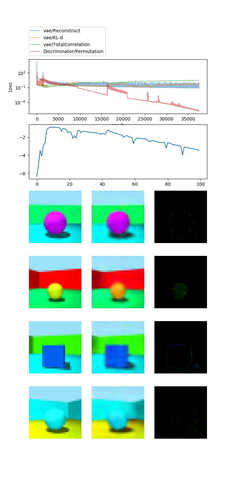
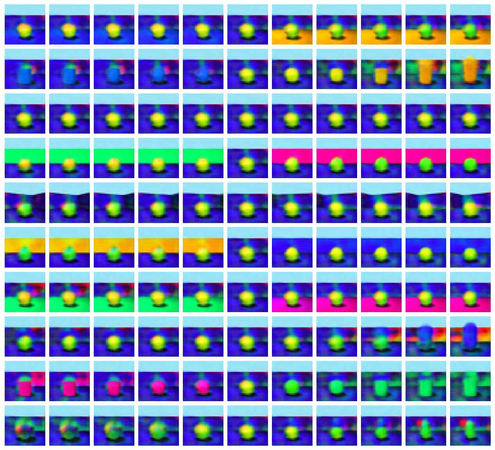
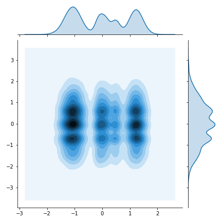

# FactorVAE

A tensorflow 2.0 implementation of the FactorVAE algorithm.

Disentangling by Factorising (Kim & Mnih, 2018) https://arxiv.org/pdf/1802.05983.pdf

You will need to download the file 3dshapes.h5 from https://github.com/deepmind/3d-shapes.

To train the model, run FactorVAE.ipynb

# Validation example

# Latent traversal
Results of latent traversal.
Each column indicates individual latent dimensions.

The reason for the noisy result of latent traversal is the gaussian constrain which is not worked insufficiently.
I seem the solution is increasing batch size and decreasing the learning rate.
And also discriminator loss and total correlation loss is not balanced so it may be affected. 

